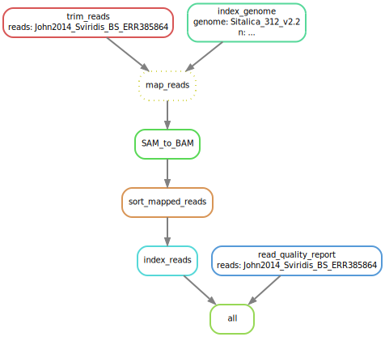

# RNA_seq_read_mapping_pipeline

Snakemake pipeline for mapping RNA-seq reads to a genome.

#### To run pipeline:
- Place genome .fa file in ```data/genomes/```
- Place paired read .fastq files in ```data/reads/```
  - Use naming format specified in config file
- Enter a conda environment with snakemake installed
- Run the following command:
```
snakemake -s RNA_seq_read_mapping_snakefile.smk --cores 10
```
#### Output:
- Mapped and sorted reads: ```<reads>_mapped_to_<genome>/<reads>_mapped_to_<genome>.bam```
- Mapped and sorted reads index file: ```<reads>_mapped_to_<genome>/<reads>_mapped_to_<genome>.bam.bai```

#### Pipeline:


